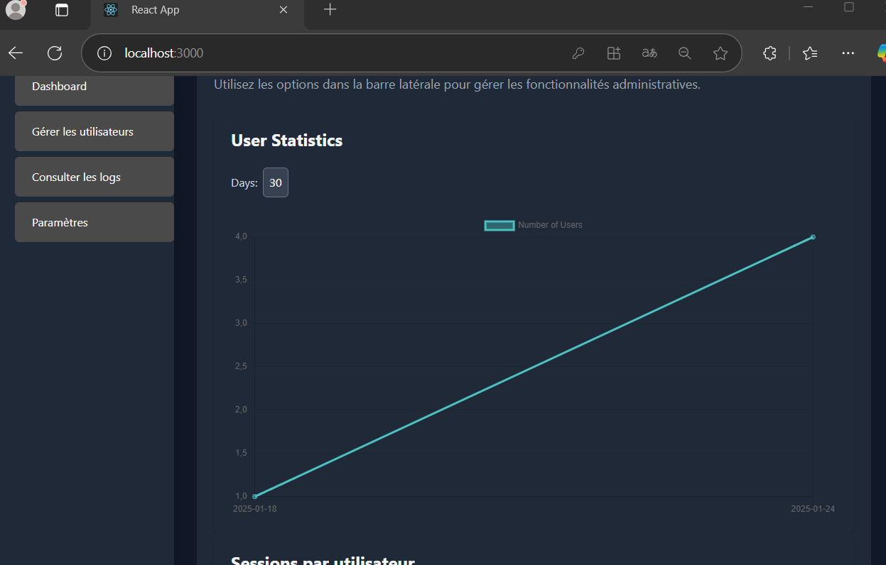
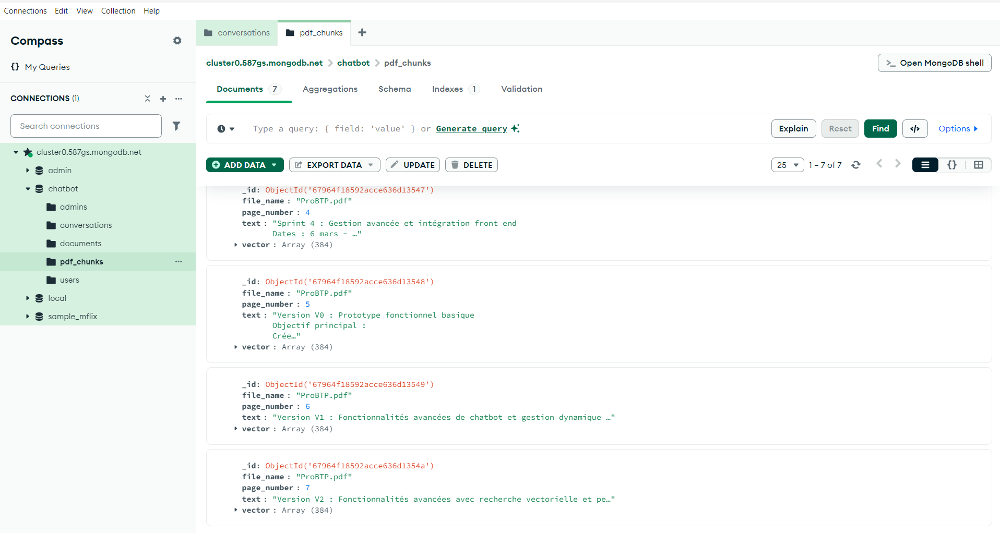

# Chatbot d'Assistance Technique

Ce projet est un chatbot intelligent combinant des fonctionnalités avancées pour offrir une assistance technique et une gestion utilisateur à travers une interface intuitive. Destiné initialement à un centre de support pour startups, il a évolué pour inclure des outils adaptés à la gestion d’administrateurs et d’utilisateurs finaux.

---

## Fonctionnalités Actuelles

### **1. Gestion de l'inscription et de la connexion des utilisateurs**

- Les utilisateurs peuvent créer un compte et se connecter pour accéder aux fonctionnalités du chatbot.
- Authentification sécurisée basée sur JWT.
- Exemple d'interface utilisateur :
  

### **2. Connexion administrateur via une clé spécifique**

- Les administrateurs peuvent se connecter en utilisant une clé unique pour accéder à des outils de gestion avancés.
- Les privilèges administratifs incluent la gestion des utilisateurs et la consultation des statistiques.

### **3. Gestion des utilisateurs (Administrateur)**

- Interface permettant :
  - **Blocage** et **déblocage** des utilisateurs.
  - Suppression des comptes inutilisés ou indésirables.
- Interface intuitive :
  

### **4. Statistiques avancées pour les administrateurs**

- Deux graphiques sont actuellement disponibles :
  1. **Nombre d'utilisateurs inscrits sur les derniers jours** :
     
  2. **Nombre de sessions créées par utilisateur** (chaque utilisateur est représenté par une colonne colorée selon ses sessions) :
     

### **5. Gestion des conversations (Utilisateur)**

- Les utilisateurs connectés peuvent :
  - Créer des sessions.
  - Démarrer des conversations dans chaque session.
- Les sessions et conversations sont enregistrées dans une base de données MongoDB.

### **6. Intégration de RAG (Retrieval-Augmented Generation)**

Le projet intègre une stratégie avancée de génération augmentée par récupération (RAG), permettant d'améliorer la pertinence des réponses générées en s'appuyant sur des documents spécifiques.

#### **Fonctionnement**

1. **Ajout de documents :**

   - **Administrateur uniquement** : L'administrateur peut ajouter des documents pertinents dans la session "Paramètres". Ces documents sont immédiatement intégrés dans la base de données et indexés pour la recherche vectorielle.
   - Les documents sont transformés en "chunks" et enrichis avec des vecteurs générés via SentenceTransformer.

   Exemple d'enregistrement de chunks dans MongoDB :
   

2. **Indexation et Recherche Vectorielle :**

   - **FAISS (Facebook AI Similarity Search)** est utilisé pour indexer les vecteurs des documents et effectuer des recherches rapides par similarité.
   - **MongoDB** sert de stockage persistant pour les documents et leurs vecteurs associés.

3. **Génération de réponses :**

   - Lorsqu'un utilisateur pose une question, le système recherche les "chunks" les plus similaires dans l'index FAISS.
   - Ces chunks sont ajoutés comme contexte dans la requête à l'API OpenAI GPT, améliorant ainsi la pertinence et la précision des réponses.

#### **Flux de traitement RAG**

- **Ajout de documents :** L'administrateur télécharge un fichier via la session "Paramètres". Les documents sont découpés en morceaux (chunks), encodés en vecteurs et indexés dans FAISS.
- **Requête utilisateur :** Lorsqu'un utilisateur pose une question, FAISS recherche les chunks pertinents.
- **Enrichissement des réponses :** Les chunks sont utilisés comme contexte dans la génération de réponses via GPT.

#### **Technologies utilisées**

- **LangChain** : Gestion des prompts et des flux conversationnels.
- **SentenceTransformer** : Génération des vecteurs d'embedding pour les documents.
- **FAISS** : Moteur de recherche vectorielle rapide et performant.
- **MongoDB** : Base de données pour stocker les documents et métadonnées.

#### **Exclusivité Administrateur**

- Seul l'administrateur a le droit d'ajouter des documents à la base vectorielle.
- Les documents ajoutés sont immédiatement disponibles pour enrichir les interactions des utilisateurs.

---

## Structure du Projet

Voici une vue d'ensemble de la structure principale du projet :

```plaintext
app/
├── api/
│   ├── endpoints/
│   │   ├── auth.py          # Gestion de l'authentification
│   │   ├── chat.py          # Gestion des conversations
│   │   └── upload_pdf.py    # Upload et traitement des documents PDF
│   ├── router.py            # Définition des routes principales
│   └── main.py              # Point d'entrée de l'application backend
├── core/
│   ├── models/              # Modèles de données (utilisateurs, sessions, etc.)
├── services/
│   ├── mongo_service.py     # Gestion des interactions MongoDB
│   ├── vector_search_service.py # Gestion de la recherche vectorielle avec FAISS
│   ├── EnhancedLLMService.py # Intégration avec OpenAI GPT
│   ├── llm_service.py       # Service pour les modèles de langage
│   └── memory.py            # Gestion de la mémoire pour les conversations
├── uploads/                 # Répertoire pour les fichiers PDF téléchargés
chatbot-frontend/
├── src/
│   ├── components/
│   │   ├── AdminDashboard.jsx       # Tableau de bord administrateur
│   │   ├── AdminLogin.jsx           # Connexion administrateur
│   │   ├── ChatWindow.jsx           # Interface principale de chat
│   │   ├── ConversationsList.jsx    # Liste des conversations
│   │   ├── SessionsPerUserChart.jsx # Graphe des sessions par utilisateur
│   │   ├── UploadPDF.jsx            # Composant d'upload de documents
│   │   ├── UserManagement.jsx       # Gestion des utilisateurs
│   │   └── UserStatsChart.jsx       # Statistiques des utilisateurs
│   ├── services/
│   │   └── api.js                   # Gestion des appels API
│   ├── App.jsx                      # Point d'entrée React
│   ├── index.js                     # Initialisation du frontend
```

---

## API Clés

Voici un aperçu des endpoints principaux de l'API :

### **Authentification**
- `POST /auth/login` : Connexion des utilisateurs.
- `POST /auth/admin-login` : Connexion des administrateurs.

### **Gestion des utilisateurs**
- `GET /admin/users` : Récupérer tous les utilisateurs.
- `PUT /admin/users/:id/block` : Bloquer un utilisateur.
- `PUT /admin/users/:id/unblock` : Débloquer un utilisateur.

### **Conversations**
- `POST /chat/sessions` : Créer une nouvelle session.
- `GET /chat/sessions` : Récupérer les sessions d'un utilisateur.
- `PUT /chat/sessions/:id/rename` : Renommer une session.

### **Upload de documents**
- `POST /upload/pdf` : Ajouter un document à la base vectorielle.

---

## Exemple d'Interaction avec RAG

### **Question utilisateur :**
"Quels sont les bénéfices d'une solution de gestion de maintenance assistée par ordinateur (GMAO) ?"

### **Flux de traitement :**
1. Recherche des chunks pertinents dans les documents ajoutés via la session "Paramètres".
2. Extraction des informations les plus pertinentes à partir des chunks.
3. Génération d'une réponse enrichie via GPT avec le contexte fourni.

### **Réponse générée :**
"Une solution de GMAO permet de réduire les coûts de maintenance, d'améliorer la gestion des actifs et d'optimiser les ressources humaines en automatisant les processus clés. Selon vos documents, elle peut également favoriser une meilleure conformité réglementaire."

---

## Configuration

### Variables d'environnement

Ce projet utilise un **environnement Conda** pour la gestion des dépendances et des variables d'environnement. Toutes les variables sont définies dans la session de l'environnement.

Voici les principales variables :

- **JWT_SECRET** : Clé secrète pour les tokens JWT.
- **ADMIN_KEY** : Clé d’authentification pour les administrateurs.
- **MONGODB_URI** : URI de connexion à la base MongoDB.
- **DATABASE_NAME** : Nom de la base de données.
- **COLLECTION_NAME** : Nom de la collection MongoDB utilisée pour les conversations.
- **OPENAI_API_KEY** : Clé API pour interagir avec OpenAI.

Exemple de gestion via `os.getenv` :

```python
import os
import bcrypt

class Settings:
    mongodb_uri: str = os.getenv("MONGODB_URI", "mongodb://localhost:27017")
    database_name: str = os.getenv("DATABASE_NAME", "chatbot")
    collection_name: str = os.getenv("COLLECTION_NAME", "conversations")
    openai_api_key: str = os.getenv("OPENAI_API_KEY", "default_value_if_not_set")
    secret_key: str = os.getenv("SECRET_KEY", "default_secret_key")
    admin_key_hash: str = bcrypt.hashpw(
        os.getenv("ADMIN_KEY", "default_admin_key").encode(), 
        bcrypt.gensalt()
    ).decode()

settings = Settings()
```

### Installation

1. Clonez le dépôt GitHub :

   ```bash
   git clone git@github.com:Hamdaoui1/chatbot.git
   cd chatbot
   ```

2. Configurez un environnement Conda et installez les dépendances :

   ```bash
   conda create --name chatbot_env python=3.9
   conda activate chatbot_env
   pip install -r requirements.txt
   ```

3. Lancez le backend FastAPI :

   ```bash
   uvicorn app.main:app --reload
   ```

4. Lancez le frontend React :

   ```bash
   cd chatbot-frontend
   npm install
   npm start
   ```

---

## Fonctionnalités Futures

1. **Statistiques supplémentaires** :
   - Analyse des interactions et tendances utilisateur.

2. **Interface utilisateur avancée** :
   - Améliorations UX pour les utilisateurs et administrateurs.

3. **Multilinguisme** :
   - Prise en charge de plusieurs langues pour élargir la portée de l’application.

4. **Gestion des permissions avancées** :
   - Contrôle granulaire des accès utilisateur.

---

## Documentation

- **Swagger API** : Accessible à [http://127.0.0.1:8000/docs](http://127.0.0.1:8000/docs).
- **Code Source** : [GitHub Repository](https://github.com/Hamdaoui1/chatbot)

---

## Auteur

Ce projet a été conçu et développé par [Hamdaoui1](https://github.com/Hamdaoui1).

